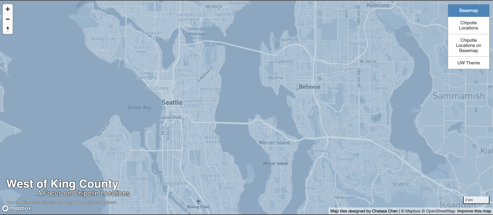
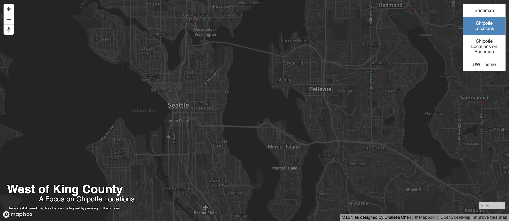
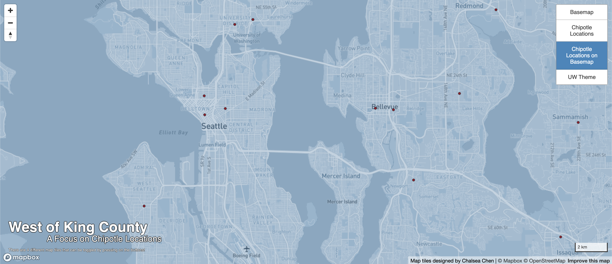
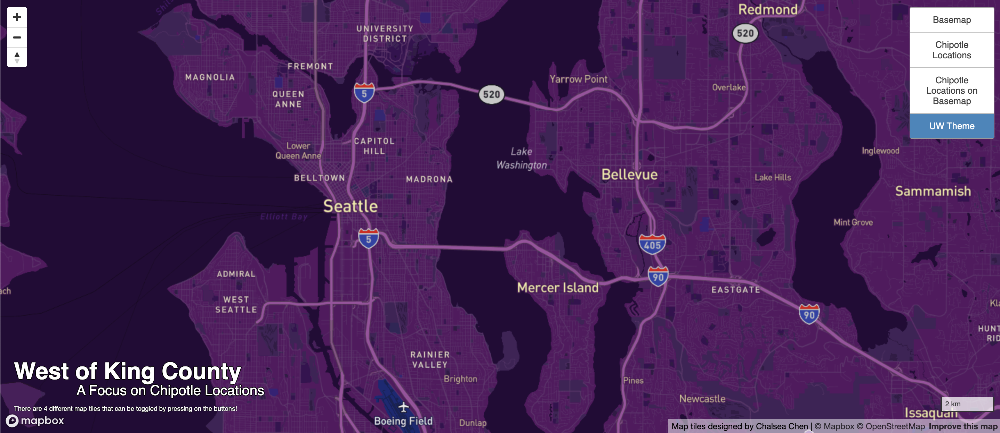

# Geog458 Lab 4: Map Design and Tile Generation

## [Access the web map here!](https://chalsea2000.github.io/geog458lab4/) 

The examined geographic area of this map is the western part of King County, mainly focusing on Seattle and Bellevue. The available zoom levels for all the map tiles are from 0-14. 

### First Tile: Basemap 

 

This is a modified basemap layer which is still a basemap but includes some slight changes in color, text, etc. 

### Second Tile: Chipotle Locations

 

This is a thematic map layer that shows the different locations of chipotle. The dataset covers the entire Washington region.  

### Third Tile: Chipotle Locations with Basemap

 

This is the thematic map layer from the second tile combined with the basemap from the first tile. It shows the different locations of chipotle on the modified basemap layer.

### Fourth Tile: UW Theme

 

This is a map layer designed over Mapbox. It embodies a map theme of UW, which is customized with the colors purple and yellow. The icons and labels are also altered a little in respondance to the UW theme.